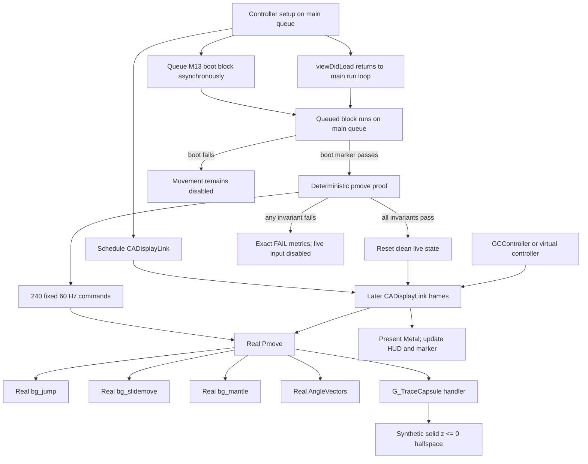

# M14 Phase 2 report — real `bg_pmove` synthetic-world sandbox

**Date:** 2026-07-13  
**Project:** BMK4 / KisakCOD arm64-apple-ios port  
**Phase:** 2 — player-movement sandbox  
**Implementation commit:**
[`aec0ab9fde031316ec7e0453bbb5ae21ae6889a0`](https://github.com/Braxton-Bevis/bmk4/commit/aec0ab9fde031316ec7e0453bbb5ae21ae6889a0)  
**First main commit containing the tested implementation and core handoff:**
[`86397828956fe9df8988969e79a468bce546fab9`](https://github.com/Braxton-Bevis/bmk4/commit/86397828956fe9df8988969e79a468bce546fab9)  
**This report:** documentation-only publication follow-up; it does not change
the tested runtime or build configuration.

This report is the detailed record of what M14 changed, why each change was
needed, how the result was proved, what remains unproved, and where the port
should go next. It supplements the chronological
[`PORT_JOURNAL.md`](../PORT_JOURNAL.md), current
[`FRONTIER_REPORT.md`](../FRONTIER_REPORT.md), and authoritative
[`NEXT_SESSION.md`](NEXT_SESSION.md).

## Contents

- [Executive result and evidence](#executive-result)
- [Scope and starting point](#scope-and-guardrails-honored)
- [Runtime architecture](#runtime-architecture)
- [Synthetic world and proof contract](#synthetic-world-model)
- [Live input, boot order, and scaffolds](#live-input-and-hud-integration)
- [Build and CI integration](#build-system-integration)
- [Complete file ledger and hazards fixed](#complete-file-by-file-ledger)
- [Verification and improvements](#local-verification-performed)
- [What is still lacking](#what-is-still-lacking)
- [Physical-iPad checklist](#physical-ipad-completion-checklist)
- [Next slice, legal boundary, and commit record](#next-bounded-engineering-slice)

## Executive result

M14 completed the cloud-verifiable portion of Phase 2. COD4's real
`bg_pmove` path now runs inside the BMK4 iOS shell against a deliberately
minimal, asset-free flat world. A deterministic 240-frame test proves that
the real movement code can:

- accelerate and walk forward;
- jump and remain airborne for a nontrivial interval;
- land back on the synthetic floor;
- remain grounded near `z=0`; and
- decelerate to rest through real friction behavior.

The same movement state is then reset and driven live by the existing iOS
controller surface. The left stick supplies forward/strafe input, A queues a
one-frame jump edge, and B holds sprint. Origin, velocity, speed, and ground
state are visible in the HUD and written into the simulator proof marker.
Hosted CI leaves those controls neutral: it proves the reset live-frame call
and marker path, while interactive thumbstick/A/B behavior is source-audited
and still awaits the physical feel test.

The exact simulator result is:

```text
boot=hunk OK (4KB tmp alloc rw), dvar OK (bmk4_boot=ipad), cmd OK — 3 stages up
pmove=real bg_pmove OK: walk+jump+land+friction on synthetic z=0
pmoveLive=org=(0.0,0.0,0.0) vel=(0.0,0.0,0.0) speed=0 ground=1
```

This is not a claim that COD4 is playable. The shell launches, staged engine
subsystems boot, and real player movement runs in an isolated synthetic
world. A COD4 map, fastfiles, full `Com_Init`, complete event input, audio,
gameplay systems, and a match are still ahead.

## Evidence summary

| Gate | Result | Evidence |
|---|---|---|
| iOS compile census | 30 PASS, 0 FAIL | Run [`29267514080`](https://github.com/Braxton-Bevis/bmk4/actions/runs/29267514080) |
| Simulator compile/link | Green | Run [`29267514067`](https://github.com/Braxton-Bevis/bmk4/actions/runs/29267514067) |
| Simulator runtime | Exact boot and pmove markers present | `simulator-launch-proof` artifact from run [`29267514067`](https://github.com/Braxton-Bevis/bmk4/actions/runs/29267514067) |
| Simulator live state | Grounded at rest at the origin | Exact `pmoveLive` line above |
| Simulator render loop | Two captured screenshots are byte-distinct | Same 14-day proof artifact in run [`29267514067`](https://github.com/Braxton-Bevis/bmk4/actions/runs/29267514067) |
| Unsigned device build | arm64, iOS platform, minimum iOS 16.0 | `device-ipa-unsigned` job in run [`29267514067`](https://github.com/Braxton-Bevis/bmk4/actions/runs/29267514067) |
| Required pmove archive | Five real objects in simulator and device lanes | Build logs in run [`29267514067`](https://github.com/Braxton-Bevis/bmk4/actions/runs/29267514067) |
| Windows regression | Debug and Release green for SP, MP, and dedicated server | Run [`29267514051`](https://github.com/Braxton-Bevis/bmk4/actions/runs/29267514051) |
| Local closure/static checks | Green | 30/30 paths, five objects, three marker lanes, two link lanes, boot closure 74/74 |
| Physical iPad M14 runtime | **Not performed** | Requires a marker pulled from the user's device |

All three canonical hosted runs use the exact implementation commit
`aec0ab9`. The next commit, `8639782`, changes only five documentation files;
there are no source or build-setting changes between the tested
implementation and that first M14 `main` head.

### Pushed-main repeat verification

Commit `8639782` was independently rebuilt after the two-commit M14 push:

| Main-branch run | Result |
|---|---|
| [`29268715852`](https://github.com/Braxton-Bevis/bmk4/actions/runs/29268715852) — iOS census | Success; downloaded artifact verified 30 PASS, 0 FAIL |
| [`29268716011`](https://github.com/Braxton-Bevis/bmk4/actions/runs/29268716011) — iOS app | Success; exact boot/pmove/live marker repeated, screenshots differed, and unsigned device job passed |
| [`29268715967`](https://github.com/Braxton-Bevis/bmk4/actions/runs/29268715967) — Windows | Success; Debug and Release passed for SP, MP, and dedicated server |

The report and runbook corrections made after those repeats are Markdown-only
and do not alter the implementation they verified.

## Scope and guardrails honored

M14 intentionally stayed inside Phase 2.

- No Phase 3 `Com_Init` census wave was started.
- No fastfile code or plan stage was implemented.
- No COD4 assets were read, installed, copied, committed, uploaded, logged,
  or placed in an artifact.
- No engine file under `src/` was edited in this slice. That means original
  Windows engine expressions did not need new conditionals and could not be
  accidentally changed by the iOS integration.
- The existing M13 boot marker remained required.
- Census, runtime, archive-member, link-order, and Windows gates were
  strengthened or preserved; none was relaxed.
- Simulator runtime is described as simulator runtime. The unsigned arm64
  app is described only as device compilation/linkage evidence.
- No physical-iPad claim is made because no M14 marker was pulled from a
  physical device.

## Starting point

At baseline commit `a0aaadd`, Phase 1 and M13 were complete:

- the iOS census was 26/26;
- the BMK4 shell launched in hosted simulator CI;
- the real hunk-memory, dvar, and command stages produced the exact M13 boot
  marker;
- an unsigned arm64 device app built with the real DXVK/MoltenVK renderer
  stack;
- Windows Debug and Release were green; and
- the complete COD4 game still did not launch.

Three partially developed Phase 2 files were parked under `docs/wip/`:

- `PmoveSandbox-wip.cpp`;
- `PmoveScaffold-wip.cpp`; and
- `PmoveScaffoldShared-wip.cpp`.

They contained the shape of a movement harness, but they were not active app
sources and still had closure, ABI, and correctness hazards. M14 restored and
finished those files rather than discarding the prior work.

## Runtime architecture



The important separation is that the world is synthetic but the movement
solver is real. The sandbox owns only the trace adapter, test commands, state
initialization, and scaffolding for not-yet-graduated dependencies.

## Real engine code in the movement archive

[`build-engine-lib.sh`](../scripts/platform/ios/build-engine-lib.sh) now
creates `libkisakpmove.a` for both `iphonesimulator` and `iphoneos`. It refuses
to create the archive if any required object is absent.

| Required object | Role in the proof |
|---|---|
| `src_bgame_bg_pmove.cpp.o` | Main `Pmove`/`PmoveSingle` solver and movement dispatch |
| `src_bgame_bg_jump.cpp.o` | Jump dvars, launch velocity, jump state, and landing interaction |
| `src_bgame_bg_slidemove.cpp.o` | Slide/step collision response and ground movement |
| `src_bgame_bg_mantle.cpp.o` | Real mantle checks reached by the pmove path, inert on a ledge-free floor |
| `src_universal_com_math_anglevectors.cpp.o` | Real view-angle movement basis used per frame |

`bg_pmove.cpp` was already one of the 26 census files. Adding the other four
real dependencies increased the census from 26 to 30 even though the required
movement archive contains five objects.

The Xcode link order is deliberately:

```text
-lkisakpmove -lkisaksmoke
```

in both base/simulator and `iphoneos` settings. This gives movement-specific
definitions first chance to resolve while retaining the established M13
smoke closure. A static check verifies both link lanes keep that order.

## Synthetic world model

The active harness is
[`PmoveSandbox.cpp`](../ios/Stub/PmoveSandbox.cpp). It implements an infinite
solid halfspace at `z <= 0` through the existing pmove trace-handler seam.

For each swept capsule/AABB query, the trace adapter:

1. ignores masks that do not request `CONTENTS_SOLID`;
2. computes the signed floor distance using the player's lower bound;
3. reports no hit when both ends remain above the floor;
4. reports a walkable `(0,0,1)` normal for floor contact;
5. identifies the hit as `ENTITYNUM_WORLD`;
6. reports `startsolid` when the sweep begins below the floor, and reports
   `allsolid` only when the end also remains below it; and
7. backs the hit fraction off by the engine clip epsilon so the final origin
   rests just above the plane.

There are intentionally no walls, stairs, slopes, ladders, mantle ledges,
moving platforms, triggers, entities, or map data. That small world is a test
fixture for movement math, not a replacement map format.

## Player-state initialization

`kisak_pmove_init()` creates one zeroed player and command context, then seeds
only the state needed by real pmove:

- normal movement type;
- gravity 800;
- speed 190;
- origin on the floor;
- `ENTITYNUM_WORLD` ground entity;
- standing view height;
- health and max health 100;
- unarmed weapon index 0;
- movement and breath multipliers 1.0;
- server-side alive trace mask; and
- server trace handler `G_TraceCapsule`.

The real `Jump_RegisterDvars()` and `Mantle_RegisterDvars()` functions run
once after M13's real dvar system is initialized. After the deterministic
proof passes, the app calls `kisak_pmove_init()` again so interactive input
starts from a clean state rather than the proof's final state.

## Deterministic proof contract

`kisak_pmove_proof()` executes 240 commands at a fixed
`1000 / 60` milliseconds per frame.

| Frame interval | Input/action | Measurement |
|---|---|---|
| 0-59 | Full forward input | At frame 59, record planar distance and speed |
| 60 | Full forward plus one jump-button frame | Begin jump edge |
| 61-119 | Full forward input | Track maximum height and airborne frames |
| 120-239 | No movement input | Allow landing and friction decay |

The success string is returned only if every invariant passes:

| Invariant | Exact condition |
|---|---|
| Walked | distance after frame 59 is greater than 24 units |
| Reached movement speed | speed after frame 59 is greater than 20 units/s |
| Jumped | maximum `z` is greater than 8 units |
| Meaningfully airborne | at least 8 frames report no ground entity |
| Landed after jump | first post-air grounded frame is later than frame 60 |
| Land height | first landing origin is within 0.25 units of `z=0` |
| Final height | final origin is within 0.25 units of `z=0` |
| Final contact | final ground entity is not `ENTITYNUM_NONE` |
| Friction to rest | final planar speed is below 1 unit/s |

If any check fails, the function returns a detailed `FAIL` string containing
walk distance/speed, apex, air-frame count, landing frame/height, final speed,
and ground state. The standalone test entry returns a nonzero process status
unless the full success string matches. The iOS app compares the same result
to the same immutable success contract before enabling live movement.

NaN or corrupt motion state cannot accidentally satisfy the proof because
the required greater-than and less-than comparisons evaluate false for NaN.

## Live input and HUD integration

The existing
[`MetalViewController.swift`](../ios/Stub/MetalViewController.swift) controller
surface now drives both the animated triangle and the real movement state.

| Surface | Existing visual behavior retained | New pmove behavior |
|---|---|---|
| Left stick Y | Moves the triangle vertically | Forward/back command |
| Left stick X | Moves the triangle horizontally | Right/left strafe command |
| A press | Toggles the background palette | Queues one jump frame |
| B hold/press | Recenters the triangle on press | Holds sprint while pressed |

The A-button handler records a queued edge. The next render frame passes the
jump bit once and immediately clears the queue. Real `Pmove` updates
`oldcmd`, so this behaves as the rising edge expected by `Jump_Check`.

Each `CADisplayLink` callback measures elapsed wall time. The bridge clamps
that value to 1-50 ms before advancing pmove, protecting the solver from zero,
nonfinite, or very large frame intervals while preserving live frame pacing.

The HUD shows:

- immutable proof status;
- live origin;
- velocity components;
- planar speed; and
- grounded/not-grounded state.

The marker is rewritten after asynchronous controller state settles, so the
hosted proof includes both the fixed proof line and a live state line.

CI does not synthesize stick or button events. Its neutral
`pmoveLive=org=(0.0,0.0,0.0) ... ground=1` line proves that a post-proof reset
state advanced through the live callback and reached the marker. The input
handlers and one-frame edge semantics were source-audited, but their actual
feel and interactive response remain part of the physical-iPad checklist.

## Boot ordering and crash containment

M14 does not bypass the M13 boot sequence.

1. Controller setup schedules the `CADisplayLink` on the main run loop.
2. `runBootSmoke()` queues its crash-guarded work with
   `DispatchQueue.main.async`, allowing `viewDidLoad` to finish first.
3. The queued block then executes M13 boot smoke on the main queue, satisfying
   the hunk subsystem's main-thread requirement.
4. Real hunk, dvar, and command behavior must produce the boot success result.
5. Only then does M14 synchronously run the pmove proof and register real
   jump/mantle dvars inside that queued block.
6. Live movement is enabled only after exact proof success.
7. Subsequent display-link callbacks advance the clean live state, present
   Metal frames, update the HUD, and publish the settled proof marker.

A `pmove_attempt_in_flight` sentinel records an interrupted proof attempt.
After three consecutive crash-marked launches, the app stops retrying and
shows that the crash guard is active. A successful call removes the sentinel.
This contains a bad closure without converting a crash into a false success.

## Scaffold restoration and corrections

The parked scaffolds were not copied blindly. They were reviewed against real
call sites and fixed before activation.

### `PmoveScaffold.cpp`

This file supplies movement dvar data, minimal real semantics, and inert
animation/weapon hooks for dependencies that have not yet graduated into the
iOS archive.

Important corrections and guarantees:

- integer dvar defaults now write only the integer union lane;
  `player_sprintForwardMinimum=105` no longer collapses to boolean `1`;
- float, integer, and boolean helper constructors preserve their requested
  current/latched/reset values;
- `Trace_GetEntityHitId` uses the real entity-hit semantics;
- a zeroed weapon definition keeps the intentionally unarmed proof path inert;
- mantle animation hooks remain unreachable in the no-ledge world; and
- `XAnimGetAbsDelta` writes the real two-float rotation representation rather
  than overrunning it with four floats.

### `PmoveScaffoldShared.cpp`

Generic print/assert/dvar bodies that would collide with M13 are compiled only
for `PMOVE_STANDALONE_SCAFFOLD`. In the combined app, the file defines only
helpers still absent from the boot closure.

`Sys_SnapVector` now calls the engine's nearest-even `SnapFloat` for all three
components. The older half-away behavior could have diverged from real engine
motion at exact half values.

### Real `AngleVectors`

The abort-loud placeholder was removed from `EngineSmoke.cpp`. The app now
links `src/universal/com_math_anglevectors.cpp`, ensuring every movement frame
uses the real engine basis calculation.

## Build-system integration

### Census

[`scripts/ios/CMakeLists.txt`](../scripts/ios/CMakeLists.txt) now tracks 30
translation units. The four additions are:

- `src/bgame/bg_jump.cpp`;
- `src/bgame/bg_slidemove.cpp`;
- `src/bgame/bg_mantle.cpp`; and
- `src/universal/com_math_anglevectors.cpp`.

The compile-probe workflow now requires:

```text
total >= 30
pass == total
fail == 0
```

All tracked source paths must also exist. This turns a missing or silently
skipped file into a failed gate.

### App compiler settings

[`ios/project.yml`](../ios/project.yml) now aligns app-side C++ compilation
with the engine archive:

- engine, dependency, and staged DXVK header paths;
- `KISAK_MP=1` and `KISAK_IOS=1`;
- GNU C++20;
- no strict aliasing;
- wrapping signed arithmetic;
- Microsoft extensions;
- delayed template parsing; and
- the existing narrowing-warning accommodation.

This prevents the app bridge/scaffolds from being compiled under a subtly
different ABI or preprocessor world than the real engine objects.

### Swift bridge

[`BridgingHeader.h`](../ios/Stub/BridgingHeader.h) declares:

```c
void kisak_pmove_init(void);
const char *kisak_pmove_proof(void);
const char *kisak_pmove_frame(float forwardmove, float rightmove,
                              int jump, int sprint, float dtMs);
```

The C declarations match the `extern "C"` definitions and Swift's imported
scalar types.

## CI changes

### iOS compile probe

`.github/workflows/ios-compile-probe.yml` now:

- expects at least 30 tracked units;
- asserts every tracked unit passed;
- asserts zero failures; and
- still uploads the per-file census artifact.

### iOS simulator/device workflow

`.github/workflows/ios-stub.yml` now:

- triggers for relevant `src/`, `deps/`, and `scripts/` changes;
- stages the patched DXVK headers needed by the simulator app compile;
- labels and builds the real pmove subset in both SDK lanes;
- retains the M13 boot-marker check; and
- requires this full fixed line with `grep -Fqx`:

```text
pmove=real bg_pmove OK: walk+jump+land+friction on synthetic z=0
```

A substring, partial stage, different world description, or `FAIL` metrics
cannot satisfy that assertion.

### Windows workflow

The existing full DirectX workflow builds these targets sequentially in both
Debug and Release:

- `KisakCOD-sp`;
- `KisakCOD-mp`; and
- `KisakCOD-dedi`.

Run `29267514051` completed both jobs successfully at `aec0ab9`. Because M14
does not edit `src/`, this is also strong evidence that the active iOS app and
build changes did not alter Windows engine behavior.

## Complete file-by-file ledger

### Runtime and bridge

| File | Change |
|---|---|
| `docs/wip/PmoveSandbox-wip.cpp` → `ios/Stub/PmoveSandbox.cpp` | Restored active sandbox; completed flat trace, initialization, live frame bridge, deterministic proof, exact result, and standalone exit contract |
| `docs/wip/PmoveScaffold-wip.cpp` → `ios/Stub/PmoveScaffold.cpp` | Restored active closure; fixed dvar union handling and mantle rotation ABI |
| `docs/wip/PmoveScaffoldShared-wip.cpp` → `ios/Stub/PmoveScaffoldShared.cpp` | Restored shared closure; isolated duplicate standalone bodies and corrected snap semantics |
| `ios/Stub/BridgingHeader.h` | Added the three C bridge declarations |
| `ios/Stub/EngineSmoke.cpp` | Removed the aborting `AngleVectors` placeholder so the real leaf resolves |
| `ios/Stub/MetalViewController.swift` | Added boot-gated proof, crash sentinel, live reset, measured frames, controls, HUD, and marker fields |

### Build and CI

| File | Change |
|---|---|
| `scripts/ios/CMakeLists.txt` | Expanded census 26 → 30 with four real support units |
| `scripts/platform/ios/build-engine-lib.sh` | Added hard-required five-object `libkisakpmove.a` in both SDK lanes |
| `ios/project.yml` | Added matching headers/defines/C++ flags and linked pmove before smoke |
| `.github/workflows/ios-compile-probe.yml` | Raised the closure floor and hard-required pass==total, fail==0 |
| `.github/workflows/ios-stub.yml` | Added relevant triggers, simulator headers, pmove build labeling, and exact runtime assertion |

### Documentation

| File | Change |
|---|---|
| `README.md` | Updated census/frontier/checklist/roadmap and separated hosted movement proof from physical feel testing |
| `FRONTIER_REPORT.md` | Advanced the frontier to M14 and documented movement architecture, remaining walls, and evidence limits |
| `PORT_JOURNAL.md` | Added milestone M14 with the full plain-language changelog, errors fixed, runs, and next hypothesis |
| `docs/NEXT_SESSION.md` | Replaced the stale Phase 2 start instructions with the verified M14 state and ordered next work |
| `ios/README.md` | Corrected deployment target 15.0 → 16.0 and documented controls, exact proof, and physical addendum procedure |
| `docs/M14_PMOVE_SANDBOX_REPORT.md` | Added this comprehensive implementation/evidence/limitations report |

## Errors and hazards found during restoration

| Hazard | Consequence if left in place | Resolution |
|---|---|---|
| Abort-loud `AngleVectors` on the live path | First real movement frame would terminate | Link the real engine leaf |
| Missing app headers/defines/flags | Bridge and engine archive could disagree on declarations or code paths | Align project settings with the archive |
| Duplicate generic scaffold symbols | Combined M13/M14 link could fail or select the wrong body | Gate generic bodies behind standalone macro |
| Half-away vector snapping | Subtle divergence from original nearest-even behavior | Use real `SnapFloat` |
| Integer dvar union overwrite | Sprint threshold 105 becomes 1 | Preserve the integer lane |
| Four-float mantle rotation write | Buffer overwrite/ABI corruption | Write the real two-float rotation |
| Optional/missing pmove members | App could link a partial or substituted solver | Hard-require all five archive objects |
| Loose success check | Partial or changed output might pass CI | Assert the exact full line |
| Proof before dvar boot | Real jump/mantle registration would use an uninitialized registry | Run only after M13 boot success |
| Reusing proof end state | Live HUD would begin after a completed test trajectory | Reinitialize after proof success |

No assertion, invariant, or runtime marker was weakened to address these
problems.

## Local verification performed

The final implementation/documentation tree passed these local read-only
checks:

- `git diff --check`;
- Git Bash syntax for `build-engine-lib.sh`;
- census total 30, unique 30, missing paths 0;
- each of the five required pmove object names appears exactly once in the
  archive construction list;
- the fixed proof text appears exactly once in native code, once in Swift,
  and once in the runtime CI assertion;
- both Xcode link lanes place pmove before smoke;
- M13 boot closure remains 74 nonblank and 74 unique symbols;
- all changed Markdown local links resolve;
- Markdown code fences are balanced;
- no binary or asset-like file was added;
- no file under `src/` changed;
- none of the three parked pmove filenames remains under `docs/wip/`; and
- local and remote `main` matched after the M14 push.

A separate read-only source audit also checked the real `Pmove` resolution,
proof false-positive behavior, `oldcmd` jump-edge handling, C/Swift ABI,
synthetic trace consumption, required archive members, and link order. It
reported no actionable defect.

## What M14 improves

In plain language, the slice changes the project from “`bg_pmove.cpp` can be
compiled for Apple ARM” to “the real movement solver demonstrably executes in
the launched iOS app and obeys a behavioral contract.” Specifically:

- compilation is now connected to runtime behavior;
- the movement dependency set is explicit and cannot silently shrink;
- CI distinguishes exact success from merely launching the shell;
- the M13 boot path and M14 movement path execute in a safe order;
- the controller surface is wired into real movement state rather than only
  a visual triangle; hosted CI proves the neutral live path, while interactive
  response remains a physical test;
- developers can see the real state in the HUD and marker;
- a failure reports useful metrics rather than a generic red job;
- Windows remains protected by full SP/MP/dedicated builds; and
- the physical-device gap is isolated as a clear human/hardware test rather
  than being confused with cloud proof.

## What is still lacking

### Phase 2 physical addendum

The cloud-verifiable implementation is complete, but the following has not
been done on the user's physical iPad:

- signed M14 installation;
- pulled M13 boot marker;
- pulled M14 pmove marker;
- left-stick feel and neutral-drift test;
- jump-button edge test;
- held sprint and release test; and
- observation of frame pacing under device load.

### Engine boot

The app still does not run full headless `Com_Init`. M13 deliberately boots
only memory, dvars, and commands; M14 runs movement after those stages. The
remaining `Com_Init` transitive closure is much larger and belongs to Phase 3.

### World and game data

The movement world is an infinite floor, not a COD4 collision map. There are
no fastfiles or proprietary assets in the workspace. Real content requires
the staged FF0-FF3 synthetic fastfile work and, only later, local/offline use
of user-owned Windows COD4 (2007) files at FF4.

### Input

The shell directly maps `GCController` values into the pmove sandbox. The
complete engine input path through `Sys_QueEvent`, client commands, and the
normal game loop is not connected yet.

### Renderer content readiness

DXVK/MoltenVK/Metal Clear/readback/Present is physically proven from M12, but
real content still needs Apple-safe dummy descriptors/resources and full
engine renderer initialization through the host-window seam.

### Audio and video

Miles/Bink remain non-native. AVAudioEngine and any video replacement are
future work.

### Playability

No map loads, no player spawns into a real level, no weapon/gameplay loop
runs, and no match starts. M14 is a real physics slice inside the shell, not a
complete game launch.

## Physical-iPad completion checklist

When the user's Mac/iPad and signing identity are available:

Choose one provisioning route before installation:

- **CI artifact route:** download `KisakStub-unsigned-ipa` from a successful
  iOS workflow run and re-sign it with Sideloadly or an Apple development
  identity. Artifacts expire after 14 days, so rerun the workflow if needed.
- **Source-build route:** reproduce the `Build renderer + engine archives`
  step in [`.github/workflows/ios-stub.yml`](../.github/workflows/ios-stub.yml)
  before generating the Xcode project. `ios/libs/` is intentionally untracked;
  a clean clone does not already contain `libkisakpmove`, `libkisaksmoke`, the
  DXVK components, headers, or `libMoltenVK.a`. The exact staging commands,
  including XcodeGen installation, are in the [iOS runbook](../ios/README.md).

1. Check out the M14 `main` head or a later descendant that has not changed
   the proof contract.
2. Provision the app through one of the two routes above. For a source build,
   generate the project from `ios/project.yml` only after staging the required
   untracked libraries and headers.
3. Build/re-sign and install the resulting app on the iPad.
4. Launch it and wait at least 10 seconds for boot, proof, live reset, and
   marker rewrite.
5. Pull `Documents/metal_first_frame.txt` from the app data container.
6. Require the exact M13 boot line.
7. Require the exact M14 pmove line.
8. Confirm `pmoveLive` reports finite origin/velocity and a plausible ground
   state.
9. Test neutral stick for unwanted drift.
10. Test forward, backward, and both strafes.
11. Test diagonals.
12. Tap A once and confirm one jump, not repeated auto-jumps.
13. Hold B while moving forward and compare sprint response; release B and
    confirm normal response returns.
14. Record device model, iPadOS version, commit SHA, signing/install method,
    full marker, and human observations in an M14 physical-device addendum.

The physical gate is complete only when the marker is actually pulled from
the device. A simulator artifact, unsigned IPA, successful installation, or
screenshot alone is insufficient.

## Next bounded engineering slice

M14 did not begin Phase 3. The physical addendum may be deferred while
starting the next cloud slice, but it is mandatory before claiming any
physical-device M13/M14 proof. The next cloud engineering slice is headless
`Com_Init`:

1. add only 5-10 translation units in a census wave;
2. run an LP64 pointer/union/cast sweep on that wave;
3. audit any `jmp_buf`/setjmp assumptions;
4. make unresolved closure explicit;
5. preserve abort-loud bodies outside the intended runtime path;
6. prove a new bounded runtime stage;
7. keep iOS census, simulator proof, device build, and Windows Debug/Release
   green; and
8. push the wave before starting another.

Fastfile work remains after Phase 3 and must follow
[`FASTFILE_PLAN.md`](FASTFILE_PLAN.md). The established choice of original
Windows Call of Duty 4: Modern Warfare (2007), Steam App 7940, does not need
to be researched again.

## Legal and asset boundary

The source port and scaffolding are GPL-3.0 work built on KisakCOD/LWSS. M14
uses no proprietary COD4 data. Future user data handling must obey all of the
following:

- user supplies a legally owned stock Windows installation;
- inventory is read-only and records only filenames, sizes, and hashes;
- game files never enter Git history;
- game files never enter CI inputs, logs, caches, or artifacts;
- FF0-FF3 use synthetic data; and
- FF4 is local/offline only.

## Commit and branch record

| Commit/ref | Meaning |
|---|---|
| `a0aaadd` | M13 baseline on `main` |
| `aec0ab9` | Complete Phase 2 implementation used by all canonical green runs |
| `origin/codex/phase2-pmove-ci` | Temporary branch used to prove `aec0ab9` before advancing `main` |
| `8639782` | First `main` head with the tested implementation and five core M14 handoff/status docs; all three main repeats green |
| This report's follow-up commit | Documentation-only report/runbook publication; no runtime or build changes |
| `origin/main` | Publication target for the implementation, evidence docs, and this report |

The temporary branch is retained; deleting it was not required to complete
the requested slice.

## Final status

Cloud-verifiable Phase 2 implementation and its core evidence are complete
and pushed. This report is a documentation-only publication follow-up. The
exact real-pmove marker,
30/30 census, simulator launch, arm64 device build, and Windows Debug/Release
regression are all green at the implementation commit. The only remaining
Phase 2 boundary is physical-iPad marker retrieval and feel testing. Phase 3,
fastfiles, proprietary assets, and complete-game claims remain outside M14.
